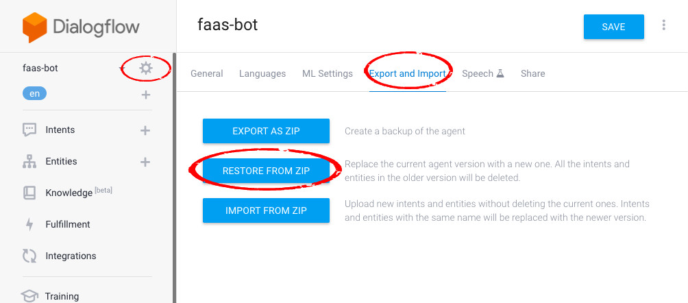

# FaaS Bot - Running Guide

To run this FaaS Bot.  we need to build the following things

- OpenFaaS service on a server which should have **Public Address** and could be accessed by Google's Dialogflow as the webhook.

- A Google Dialogflow agent
- A Slack bot App and a Slack workspace  Or A Command Line Client

## Part-1: Prepare for OpenFaaS  

> Credit to [Lab 1 - Prepare for OpenFaaS](https://github.com/openfaas/workshop/blob/master/lab1.md)

Prepare Part-1 on your **server**. For the server, the easiest way is to rent an AWS EC2 instance.

### 1.1 Docker

Follow this [guide](https://docs.docker.com/install/linux/docker-ce/ubuntu/) to install Docker CE for **Ubuntu**

### 1.2 Setup a single-node cluster

There are two options **Docker Swarm** and **Kubernetes**.

Now, we set up the cluster on **docker swarm** using: 

```sh
$ docker swarm init
```

> If you receive an error then pass the `--advertise-addr` parameter along with your laptop's IP address.

### 1.3 Docker Hub (Optional)

Using the command below to log your docker hub account if you want push image to docker hub.

```sh
$ docker login
```

### 1.4 OpenFaaS CLI

Install OpenFaaS CLI

```sh
$ curl -sL cli.openfaas.com | sudo sh
```

Test faas-cli

```sh
$ faas-cli help
$ faas-cli version
```

### 1.5 Deploy OpenFaaS

> - First clone the repo:
>
> ```sh
> $ git clone https://github.com/openfaas/faas
> ```
>
> - Now checkout the latest version with Git
>
> ```sh
> $ cd faas && \
>   git checkout master
> ```
>
> - Now deploy the stack with Docker Swarm:
>
> ```sh
> $ ./deploy_stack.sh --no-auth
> ```

## Part-2 Prepare for Bot FaaS Functions

### 2.1 Put Code on the server

You can either

- Download it from sites like gitlab / github (if you put the repo on such site)
- Transfer it using tools like `scp`
- Or other ways

### 2.2 Create virtual environments

First, Change to `tig-faas-bot` directory

```sh
$ cd tig-faas-bot
```

 If the server don't have `pip`. install it first

```sh
$ sudo apt-get install python3-pip
```

Then install `virtualenv` using pip3

 ```sh
$ sudo pip3 install virtualenv 
 ```

Create `python3` `venv` using, and you should see a directory `./venv`

```sh
$ virtualenv -p python3 venv
```

Let's active the environment just created, and you should see `(venv)` at the begin of each command.

```sh
$ source venv/bin/activate
```

> If you want to deactivate it, input `deactivate` and the `(venv)` mark will disappear

>  All subsequent.operations, by default, operate in the virtual environment just created.

###2.3 Install Python packages 

Install packages in the `tig-faas-bot/requirements.txt`, then we will install three main packages used in our bot: `pymongo`, `requests`, and `Eve`, Also, some dependencies will be installed at the same time. You could use `pip list ` to check all the package installed in the virtual environment.

```sh
$ pip install -r requirements.txt
```

### 2.4 Install MongoDB CE 

First, follow this **[guide](https://docs.mongodb.com/manual/tutorial/install-mongodb-on-ubuntu/)** to install MongoDB CE on Ubuntu

Then, start the service `mongod` using the command below. By default, mongod will run on port `27017`

```sh
$ sudo service mongod stop
```

> For restart, using
>
> ```sh
> $ sudo service mongod restart
> ```

### 2.5 Start [Python-Eve](http://python-eve.org/) - REST API framework for MongoDB 

Start python-eve using:

```sh
$ python Eve_MongoDB/mongo_eve.py &
```

and  you will see output like:

```tcl
INFO:root:Start Python-Eve...
 * Serving Flask app "eve" (lazy loading)
 * Environment: production
   WARNING: Do not use the development server in a production environment.
   Use a production WSGI server instead.
 * Debug mode: off
INFO:werkzeug: * Running on http://0.0.0.0:5000/ (Press CTRL+C to quit)
```

The Eve will connect the service `mongod` we started in `2.4`, and by default,  it will expose port `5000` for  REST operation of MongoDB. 

The `setting.py` sets one db: `db_faas_bot` and two collection  `product_info` and `session_info` for the demo bot. 

For more information, check the  `readme` under directory `Eve_MongoDB`

### 2.6 Insert Product Info to MongoDB

First change to `tig_faas_bot/Utility` using

```sh
$ cd Utility 
```

Then using the following command to Insert product info into MongoDB

 ```sh
$ python product_info_utility.py INSERT_PRODUCT_INFO ../Product_Info/product_info_list.csv 
 ```

> To check the inserted product info in the MongoDB, Using
>
> ```sh
> $ mongo
> ```
>
> Then we will enter the mongo shell, input command after `> `
>
> ```sh
> > show dbs
> > use db_faas_bot
> > show collections
> > db.product_info.find()
> ```

### 2.7 Set [Secret](https://docs.openfaas.com/reference/secrets/) for FaaS functions 

Skip this part, If you haven't built the `slack bot app` and. `Dialogflow agent`

Here we use the **docker secret** to store two tokens used in out bot:

- Token of Dialogflow Agent, which used in FaaS function: `query-dialogflow-slack`
- Token of Slack Bot App, which used in FaaS function: `post-message-slack`

First, Change to the directory `./Bot_Secrets`

```sh
$ cd Bot_Secrets 
```

And there are two secret files: `dialogflow_client_token.txt` and `slack_bot_token.txt`. Fill each file with your token. 

For Dialogflow, you can find the `Client access token` under `Setting/General` Page.  e.g.

 

For Slack Bot App, you can find the token under `OAuth * Permissions/Bot User OAuth Access Token`


Under directory `Bot_Secrets`, using the command below to create two secret which names: `dialogflow_client_token` and `slack_bot_token`.

```sh
$ docker secret create dialogflow_client_token ./dialogflow_client_token.txt
$ docker secret create slack_bot_token ./slack_bot_token.txt
```

Now, using `docker secret ls`, you will see the secret just created. And we will use these secrets in our FaaS functions Later.

```sh
$ docker secret ls
ID                          NAME                      DRIVER              CREATED             UPDATED
fwtlvoxg7iixxki0aq2wj1phl   basic-auth-password                           3 weeks ago         3 weeks ago
oqabv4l0b1v7vj80hf7wfborc   basic-auth-user                               3 weeks ago         3 weeks ago
uqzo345m40wuaxtoxiw7k4gdv   dialogflow_client_token                       4 seconds ago       4 seconds ago
z9rfc1jn3cr3im2b06a1e1ess   slack_bot_token                               26 seconds ago      26 seconds ago
```

### 2.8 Set Environment Variables (Optional) 

Skip this part, if you don't need any special change. 

>  By default, to run this demo bot, you don't need this part.

According to the OpenFaaS [guide](https://github.com/openfaas/workshop/blob/master/lab4.md#inject-configuration-through-environmental-variables), we could config the environmental variables in two ways:

- Option-1: At deployment time, custom the environmental variables at the  each function's `yml` file 
- Option-2: Use HTTP headers

We mainly config environmental variables using the first way. Here is a sample yml file from `post-message-slack.yml`.

```yaml
provider:
  name: faas
  gateway: http://127.0.0.1:8080

functions:
  post-message-slack:
    lang: python3
    handler: ./post-message-slack
    image: yangwg/post-message-slack
    environment:
      combine_output: false
      SLACK_POST_URL: https://slack.com/api/chat.postMessage
      SLACK_BOT_TOKEN_SECRET_NAME: slack_bot_token
```

Here, we configured three environment variables: 

- combine_output
- SLACK_POST_URL
- SLACK_BOT_TOKEN_SECRET_NAME

Then we can use these variables in our functions like

```python
os.getenv('SLACK_POST_URL')
```

And we will get the corresponding value: `https://slack.com/api/chat.postMessage`

If you need setting any environmental variables, 

- For setting at the `yml` file, follow the example above 
- For setting at HTTP header, refer this [part](https://github.com/openfaas/workshop/blob/master/lab4.md#use-http-context---querystring--headers) in the guide.

### 2.9 Built and Deploy Functions 

Now, first change to the function directory: `tig_faas_bot/FaaS_Functions/Slack_Version`

```sh
$ cd FaaS_Functions/Slack_Version/
$ ls
```

Then we could see the following 7 functions: 

- bot-crud-slack
- get-option-list-slack
- get-user-selected-option-from-slack-slack
- nlp-webhook-slack
- post-message-slack
- query-dialogflow-slack
- slack-event-webhook-slack

Then, we need to pull templates for FaaS functions:

```sh
$ faas-cli template pull
```

To build, push (optional), deploy a function, we use the following workflow:

```sh
$ faas-cli build -f ./sample-function-name.yml
$ faas-cli push -f ./sample-function-name.yml
$ faas-cli deploy -f ./sample-function-name.yml
```

> The second command is optional, which will push the image to Docker Hub

For the 7 functions mentioned above, we could either  build & deploy them one by one like this 

```sh
$ faas-cli build -f ./bot-crud-slack.yml
$ faas-cli deploy -f ./bot-crud-slack.yml

$ faas-cli build -f ./get-option-list-slack.yml
$ faas-cli deploy -f ./get-option-list-slack.yml

...

$ faas-cli build -f ./slack-event-webhook-slack.yml
$ faas-cli deploy -f ./slack-event-webhook-slack.yml
```

Or using the script `script_build_deploy_bot_functions.py` under same directory

```sh
$ python ./script_build_deploy_bot_functions.py 
```

The script will help us build and deploy functions one by one. Now, we use `docker service ls` to look up functions just deployed. 

```sh
$ docker service ls
ID                  NAME                                        MODE                REPLICAS            IMAGE                                                     PORTS
2t718yxemlas        bot-crud-slack                              replicated          1/1                 yangwg/bot-crud-slack:latest
o8k9wdm773k4        func_alertmanager                           replicated          1/1                 prom/alertmanager:v0.15.0-rc.0
kejpa66r336c        func_faas-swarm                             replicated          1/1                 openfaas/faas-swarm:0.3.5
1vqdfc73smy4        func_gateway                                replicated          1/1                 openfaas/gateway:0.8.5                                    *:8080->8080/tcp
vkm8czievi8h        func_nats                                   replicated          1/1                 nats-streaming:0.6.0
j25ms4v90f0f        func_prometheus                             replicated          1/1                 prom/prometheus:v2.2.0                                    *:9090->9090/tcp
q16e2l464c85        func_queue-worker                           replicated          1/1                 openfaas/queue-worker:0.4.8
i55qsiir6hxv        get-option-list-slack                       replicated          1/1                 yangwg/get-option-list-slack:latest
8dy9kuhjuce5        get-user-selected-option-from-slack-slack   replicated          1/1                 yangwg/get-user-selected-option-from-slack-slack:latest
9vhcyu6enwus        nlp-webhook-slack                           replicated          1/1                 yangwg/nlp-webhook-slack:latest
zx0w0w73oeqr        post-message-slack                          replicated          1/1                 yangwg/post-message-slack:latest
z0s6ntimdgcb        query-dialogflow-slack                      replicated          1/1                 yangwg/query-dialogflow-slack:latest
de4rtprgr3kg        slack-event-webhook-slack                   replicated          1/1                 yangwg/slack-event-webhook-slack:latest
```

## Part-3 Build a Google Dialogflow Agent

### 3.1 Create an Empty Agent 

First, follow this [guide](https://dialogflow.com/docs/getting-started/create-account) to create you Dialogflow account.

Then, follow next [guide](https://dialogflow.com/docs/getting-started/first-agent) to create an empty agent

> For agent name, using any name you like, e.g. `faas-bot`
>
> For language, using the default language `English-en` 

### 3.2 Import Agent From ZIP

First enter the page below.



Then upload zip file `faas-bot.zip` under path `tig_faas_bot/Dialogflow_File`. Follow the instructions to restore it.

Now you could see intents and entities imported via Dialogflow's page `Intents` and `Entities`.

We imported 9 intents ( `addToCart `  / `checkOut` ... `show_cart`) and 1 entity `@product_name_synonyms`

### 3.3 Set up Webhook for Dialogflow

By default, the OpenFaaS running on the server's port `8080`. To invoke the function we deployed: we need the route for the function. 

For example, you rented an EC2 instance, and its public IP is `a.b.c.d`,  and you have a function name: `sample-faas-function`. The function route format is `http://gateway:8080/function/{function_name}` or `http://gateway:8080/async-function/{function_name}`. So,

- To call synchronously, we use URL: `http://a.b.c.d:8080/function/sample-faas-function`
- To call asynchronously, we use URL: `http://a.b.c.d:8080/async-function/sample-faas-function`

>  You could refer [this](https://github.com/openfaas/faas/blob/master/guide/asynchronous.md) for more info about function invoke.

In `Part 2.9`, we built and deployed 7 functions on the server. The FaaS function `nlp-webhook-slack` is working as the DialogFlow Webhook. Supposing the server IP is `a.b.c.d`, we need to use synchronous call to invoke `nlp-webhook-slack`. So:

- Open Dialogflow's Fulfillment setting page as the figure below， `Enable` the Webhook
- Fill the field URL with `http://a.b.c.d:8080/function/nlp-webhook-slack`
- Click Button `Save` to save the webhook setting.

> Replace a.b.c.d with your own IP or domain. 


### 3.4 Set Up Dialogflow Token in Docker Secret

If you didn't set Dialogflow Token in `Part 2.7`, go back to `Part 2.7`. Follow the instructions to save you newly created agent token to Docker Secret.

## Part-4 Build Slack Bot App

### 4.1 Create a new workspace

Go to [https://slack.com/create#email](https://slack.com/create#email)   Follow the Slack instructions to Create a workspace. And you will get the workspace address like `tigfaasdemosample.slack.com`

> For the workspace name, use any you like

### 4.2 Create Slack App

Go to https://api.slack.com/apps, Click `Create New App`, Fill `App Name` (e.g. TIG_FaaS_Bot)and Choose `Workspace`

> For the bot app name, use any you like
>
> For the workspace, use the one created in `Part 4.1`


For example, we created a bot `TIG_FAAS_BOT` and works in  workspace `TIG_FAAS_DEMO`


### 4.3 Set up Bot

#### 4.3.1 Add Bot User

In the Slack app, go to the `Bot users` section and click the `Add a Bot User` button.


#### 4.3.2 Event Subscriptions 

- `Enable` events in the `Event Subscriptions` section.
- Select necessary events in "Subscribe to Bot Events" section. Here we only need `message.im` . These events will define which message types (direct, in channel, etc.) your bot will react to. 
- Like `Part 3.3`, we use function `slack-event-webhook-slack` to receive slack event request.  Fill the field with function `slack-event-webhook-slack` 's address `http://a.b.c.d:8080/function/slack-event-webhook-slack` (You should replace `a.b.c.d` with your own server's IP )
- Save changes.


#### 4.3.3 Interactive Components

The interactive components are used for handle user's action with button, drop-down menu and so on. In our bot, we use this feature to help user select from options list when input a product synonym. 

- `Enable` events in the `Event Subscriptions` section.
- Like `Part 4.3.2`, we need enable the `Interactive Components`. And we use function `get-user-selected-option-from-slack-slack` to handle user's interactivity.  Fill the field with function `get-user-selected-option-from-slack-slack` 's address `http://a.b.c.d:8080/function/get-user-selected-option-from-slack-slack` (You should replace `a.b.c.d` with your own server's IP )
- Save changes.


### 

#### 4.3.4 OAuth & Permissions

Click the `Install App to Workspace`, add your bot to the workspace created in `Part 4.1`


After that, the `OAuth & Permissions` interface will look like this. And you get the token: `Bot User OAuth Access Token` we will use in `Part 4.4` .


Next, scroll down to the `Scope` section. add permission scopes: `chat:write:bot` for the bot.  


### 4.4 Set Up Slack Bot Token in Docker Secret

Like `Part 2.7` and `Part 3.4`, if you didn't set up Slack Bot Token in `Part 2.7`, go back to `Part 2.7`. Follow the instructions to save you new created bots' token to Docker Secret.

## Part-5 Re-check and Start Chat with FaaS-Bot

### 5.1 Re-check

Before chatting with the bot. Make sure the following thing are right:

- service `mongod` is running, if not, go back to `Part 2.4` 
- `python-eve` is running, if not, go back to `Part 2.5`
- all needed 7 Faas functions are deployed, if not, go back to `Part 2.9`
- Two tokens are configured right with docker secret, if not, go back to `Part 2.7`
- Google Dialgflow agent is right, if not, go back to `Part 3`
- Slack Bot app is right, if not, go back to `Part 4`

If you want to see the running log of each function described in `Part 2.9`,  use the command below to view it

```sh
$ docker service logs -f [function-name]
```

like

```sh
$ docker service logs -f slack-event-webhook-slack
$ docker service logs -f query-dialogflow-slack
```

### 5.2 Start 

Now,  we can start to chat with our bot. 

- Open the workspace created in `Part 4.1`
- Click your bot under sidebar `Apps`
- Text message in the input box and start the chat

Wath the Demo Video `FaaS_Slack_Bot_Demo.MOV` and README `Bot Input Guide` to learn how to chat with the bot. 


