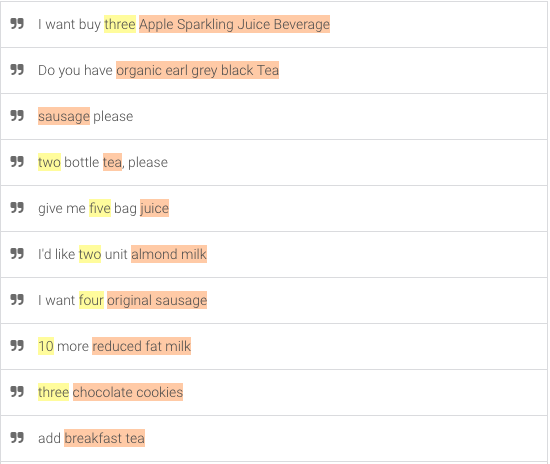
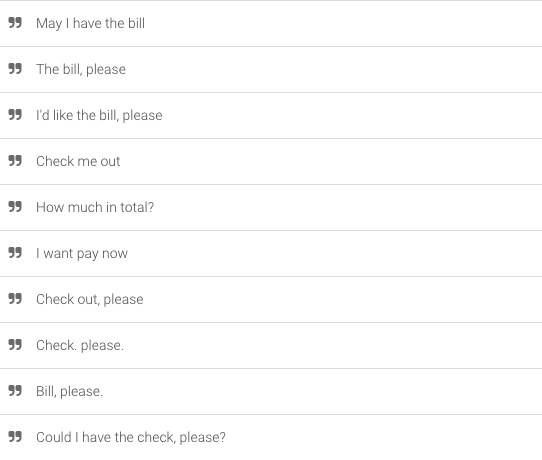
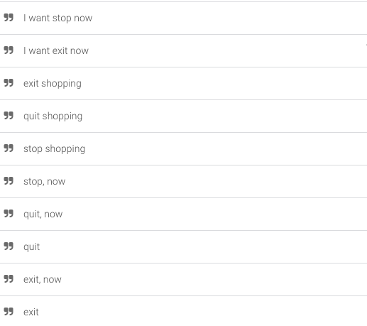
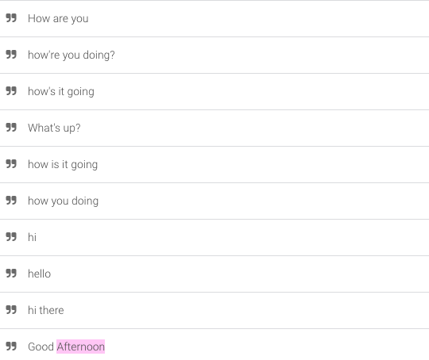
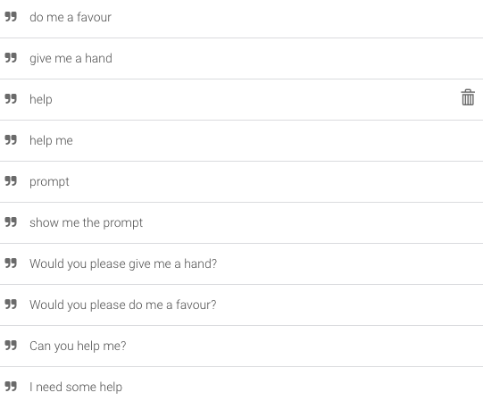
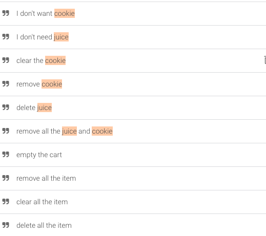
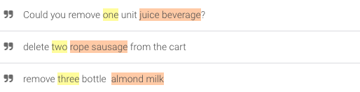
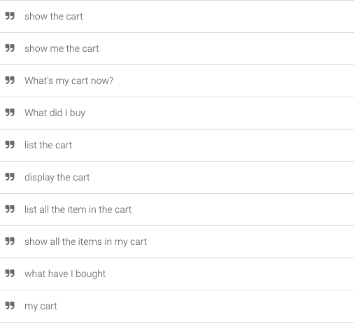

# Bot Input Guide

A pre-built Dialogflow agent `faas-bot.zip` is included under path `tig_faas_bot/Dialogflow_File`.

For how to use the pre-built agent, check the running guide `Part 3`.

Now, let's see what inputs are acceptable for this bot.

> Don't worry cases like:
>
> `May I` vs `Can I`
>
> `I'd` vs `I would`
>
> `cookie` vs `cookies`
>
> Dialogflow has handled all such cases for you.

## Intents

> An **intent** represents a mapping between what a user says and what action should be taken by your software.
>
> For more info about the intents, check the [official document](https://dialogflow.com/docs/intents)

For this pre-built agent, it has 8 self defined intents and 1 fallback intent.

> Sorry for the inconsistency of intent name style, as some of the intent inherited from this [repo](https://github.com/wwyiyi/95729cui)

**Self-defined Intents:**

- `addToCart`
- `checkOut`
- `end`
- `greeting`
- `help`
- `remove_all`
- `removeFromCart`
- `show_cart`

**Fallback Intent:**

- `Default FallBack Intent`

### Intent Intro

#### `addToCart`

##### Description

Add items to shopping cart.

##### Sample Input




#### `checkOut`

##### Description

Check out.

##### Sample Input



#### `end`

##### Description

Terminate current chat

##### Sample Input



#### `greeting`

##### Description

Greeting to bot.

##### Sample Input



#### `help`

##### Description

Ask for help.

##### Sample Input



#### `remove_all`

##### Description

Delete the a single item or all items in the cart.

##### Sample Input



#### `removeFromCart`

##### Description

Remove a certain number of items from cart

##### Sample Input



#### `show_cart`

##### Description

List items in the cart.

##### Sample Input




#### `Default FallBack Intent`

#####Description

All input that can't be classified as categories above will come here.

## Entities

> Entities are powerful tools used for extracting [parameter values](https://dialogflow.com/docs/actions-and-parameters#parameters) from natural language inputs. Any important data you want to get from a user's request, will have a corresponding entity.
>
>  For more info about the entities, check [here](https://dialogflow.com/docs/entities)

For this bot, we use system entity `@sys.number-integer` to extract number in userinput, like `one`, `second`, `36`

We built a small POC dataset for this bot, includes:

- 7 Juice
- 3 Sausage
- 3 Tea
- 2 Milk
- 1 Cookie

The 16 product list is under`tig_faas_bot/Product_Info/product_info_list.csv`

To extract product names. we defined a kind of entity `@product_name_synonyms`, and set synonyms for each product. like `tea`, `blend tea`, `black tea` `earl grey black tea`. The whole list is in `tig_faas_bot/Product_Info/product_name_and_synonym_entity_set.csv` . The map relationship is in `tig_faas_bot/Product_Info/entity_product_name_map.csv` Only product name belongs  to the entity set could be extracted by dialogFlow. 

> You could also view Product Info List and Entity Set in Appendix below.

## Appendix 

### Product Info List

```
Apple Sparkling Juice Beverage,3.97
All Natural 100% Apple Juice,4.11
Organic Pasteurized Apple Juice,4.20
Peach Mango Juice,2.98
Pineapple Orange Juice,2.77
Organic Orange Juice Concentrate,6.99
Organic Orange Turmeric Juice,5.73
Original Pork Sausage,7.23
Smoked Polish Sausage,6.39
Smoked Turkey Rope Sausage,11.57
Organic Breakfast Blend Black Tea,4.42
Organic Earl Grey Black Tea,5.50
Sencha Shot Japanese Green Tea,2.98
2% Milkfat Reduced Fat Milk,3.56
Vanilla Bean Almond Milk,5.36
Chocolate Sandwich Cookies,6.99
```

### Entity Set

This is all the product name entity the bot could extract.

```
2% reduced fat milk
2% Milkfat Reduced Fat Milk
organic pasteurized juice
orange juice concentrate
Pineapple Orange Juice
smoked polish sausage
sparkling juice beverage
Original Pork Sausage
original sausage
natural apple juice
tea
orange concentrate
apple sparkling juice
organic orange turmeric juice
sandwich cookie
organic pasteurized apple juice
juice concentrate
breakfast tea
smoked sausage
sencha green tea
organic juice
all natural apple juice
pasteurized juice
sausage
apple sparkling beverage
orange juice
reduced fat milk
chocolate sandwich cookie
sparkling juice
sencha shot japanese green tea
organic orange concentrate
Organic Orange Juice Concentrate
organic earl grey black Tea
Peach Mango Juice
sencha japanese green tea
orange turmeric juice
sencha japan green tea
beverage
smoked rope sausage
natural juice
2% milkfat reduced fat milk
vanilla bean almond milk
Chocolate Sandwich Cookies
Organic Breakfast Blend Black Tea
Vanilla Bean Almond Milk
pineapple juice
organic concentrate
organic black tea
cookie
earl grey black tea
original pork sausage
Organic Earl Grey Black Tea
black tea
Apple Sparkling Juice Beverage
Smoked Polish Sausage
apple sparkling juice beverage
turkey sausage
bean milk
rope sausage
all natural 100% apple juice
organic juice concentrate
Sencha Shot Japanese Green Tea
mango juice
japanese green tea
breakfast blend black tea
organic breakfast blend black tea
sparkling beverage
All Natural 100% Apple Juice
turmeric juice
Organic Pasteurized Apple Juice
polish sausage
smoked turkey sausage
pork sausage
apple juice beverage
apple beverage
apple juice
Smoked Turkey Rope Sausage
juice
Organic Orange Turmeric Juice
pasteurized apple juice
organic orange juice
organic orange juice concentrate
vanilla milk
blend black tea
vanilla almond milk
pineapple orange juice
turkey rope sausage
breakfast black tea
bean almond milk
blend tea
milk
chocolate cookie
almond milk
peach juice
green tea
japan green tea
peach mango juice
concentrate
organic apple juice
organic turmeric juice
vanilla bean milk
juice beverage
smoked turkey rope sausage
```


