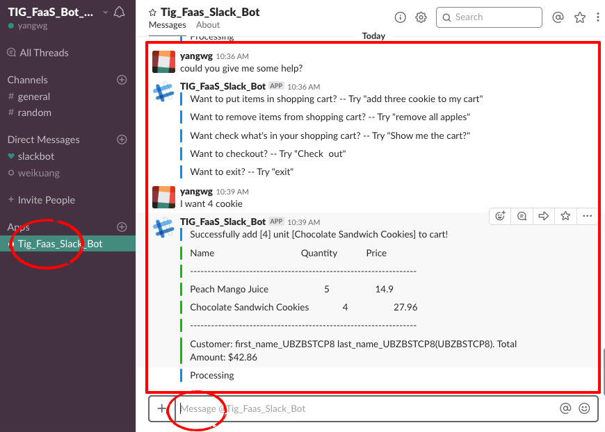
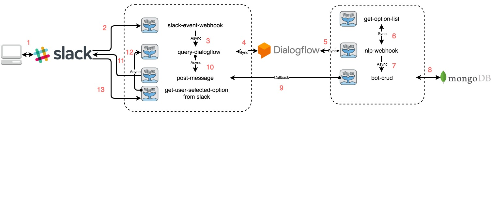

# FaaS Slack Bot

## Intro

Serverless Computing is on the rise. To achieve serverless computing, many companies have released their FaaS products: AWS Lambda, Google Cloud Functions, Azure Functions, and so on. 

Recently, JD's TIG released its own Function Platform: [Fibonacci](http://fib.jd.com/).  The fib needs some projects to demonstrate its features .  Not sensititve to delay, and with large fluctuations in requests number, chatbot is a perfect use case for FaaS. So we started building this bot.

We chose to build a task-oriented bot. Considering the business scenario of JD, we decided to build a shopping chatbot. A simple open-source CLI [shopping bot](https://github.com/wwyiyi/95729cui) is chosen as the start point. And we use OpenFaaS to turn it serverless. 

> Credit to [wwyiyi](https://github.com/wwyiyi) for offer the initial repo.  

## Overview

This FaaS Slack Bot built with [OpenFaaS](https://www.openfaas.com/), [Dialogflow](https://dialogflow.com/),  [Slack](https://slack.com/), and [mongoDB](https://www.mongodb.com/).

- **Slack** for input and output chat messages
- **Dialogflow** for Natural Language  Understanding(NLU)
- **mongoDB** for data persistence 
- **FaaS functions** for processing running logic

It allows the user:

- adding/removing items towards a shopping cart
- view items in the cart
- check out and exit shopping. 
- greeting / help

## Chat Interface

## Workflow

 

###  Function Introduction

- **slack-event-webhook**: receive events happened in chat interface, like user post message
- **query-dialogflow**: get user-input from an event and send it to Dialogflow 
- **nlp-webhook**: get processed intent/parameters/contexts, perform corresponding operations
- **get-option-list**: get options when input contains synonym
- **bot-crud**: data persistence
- **post-message:** post response for user-input as a bot user
- **get-user-selected-options from slack**: handle rich message operation from the user

### Workflow Example

Let's take add items for example.  What happens after user input `add 36 juice to the cart`?

- Step 1-`Route 1`: User input `add 36 juice to the cart` in the Slack Interface
- Step 2-`Route 2`: Slack sent userinput to FaaS function `slack-event-webhook`
- Step 3-`Route 3`: The webhook judge the message was from user, not the bot, forward this message to function `query_dialogflow` 
- Step 4-`Route 4`: `query-dialogflow` initiate an HTTP request to Dialogflow 
- Step 5-`Route 5`: Dialogflow process user_input, get intent, extract parameters, send it to function `nlp-webhook`
- Step 6-`Route 6`: Webhook handle the request by intent type. For this input, the intent is `addToCart`,  parameter: {quantity: 36, product_name: juice},  `nlp-webhook` ask `get-option-list` what kind of juice the store have? 
- Step 7: `get-option-list` check what kind of juice it has, return option list to `nlp-webhook`
- Step 8- `Route 5, 4`: There are 3 kinds of juice, `juice a`, `juice b`, `juice c`.  So the webhook return option list, prompt message back to `query-dialogflow`
- Step 9-`Route 10`: `query-dialogflow` send the dialogflow response to `post-message`
- Step 10-`Route 11`: `post-message` post those responses back to slack as a bot user. 
- Step 11-`Route 1`: The bot post a drop-down menu, let user select which juice he / she want to buy. 
- Step 12-`Route 1`: User selects one juice from the list, for example `juice b`.  
- Step 13-`Route 13`: User's select action send to function `get-user-selected-option-from-slack`. 
- Step 14-`Route 12`: `get-user-selected-option-from-slack` extract parameters and send a message `I choose number 2` on behalf of the user to `query-dialogflow`
- Step 15-`Route 4, 5`: `query-dialogflow` send a query request to Dialogflow, then dialogflow send the processed message to `nlp-webhook` , Now, the intent is ` addToCart-followup` , and know the user want `juice b`, it could get quantity `36` from Dialogflow context. `nlp-webhook` call function `bot-crud`, and send the response. Follow the `Route5, 4, 10, 11, 1`, like steps above.
- Step 16- `Route-7, 9`: webhook ask function `bot-crud` to update cart info,  send execute result to callback    `post-message`
- Step 17-`Route 11, 1`: `post-message` receives messages from `bot-crud`, post it back to slack chat window.

Other intents follow the same workflow, but with fewer steps.

## Guide

### How to build & run

Check `Guides/Bot Build & Run Guide`, follow it. You could build and run the bot.

### How it work？

Open `Demo/FaaS_Slack_Bot_Demo.MOV`, watch the video. 

### What message could I input?

Check `Guides/Bot Input Guide`

### What learn more about OpenFaaS / Slack / Dialogflow?

Check `Guides/Reference Summary`

## Directory / File Description

- `Demo` 

  - `FaaS_Bot_yangwg.pptx`: Demo PPT

  - `FaaS_Slack_Bot_Demo.MOV`: Demo Video

- `Fib_Test`

  - `Fibonacci试用记录_Weiguang_Yang回复.docx` : Fib Test Record

- `file_tree.txt`: File tree of the whole project

- `Guides` 

  - `Bot Build & Run Guide`: Guide for how to build and run this bot, **Must Read**
  - `Bot Input Guide`: Guide for user input, **Must Read**
  - `Reference Summary`: Summary for related repo / doc / guide / articles

- `README`: **Must Read**
- `tig_faas_bot` : Code Repo, **Must Have**

  

