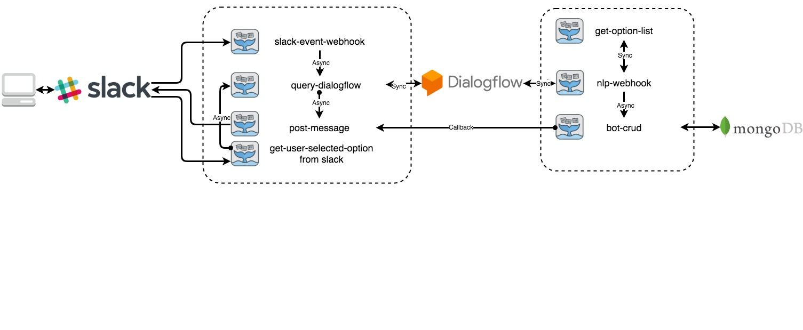

# FaaS Functions 

This repo is related with `Running Guide` `Part 2.9`.

It contains 7 FaaS functions used in the bot. And 1 python script for build and deploy functions.

> The name of each function is slightly different from the Description below. All the functions ended with `-slack` represent it belongs to the `Slack Version`

## Function Workflow



- **slack-event-webhook**: receive events happened in the chat interface
- **query-dialogflow**: extract user-input from an event and send it to Dialogflow 
- **nlp-webhook**: get processed intent/parameters/contexts, perform corresponding operations
- **get-option-list**: get options when input contains synonym
- **bot-crud**: data persistence
- **post-message:** post response for user-input as a bot user
- **get-user-selected-options from slack**: handle rich message operation from the user

## Function Config

>  All functions are all well-configured. No additional configuration required if follow the `Running Guide`

For extra configuration, check running guide `Part 2.8`

## Function Log

If you want to see the running log of each function, use the command below to view it

```sh
$ docker service logs -f [function-name]
```

like

```sh
$ docker service logs -f slack-event-webhook-slack
$ docker service logs -f query-dialogflow-slack
```